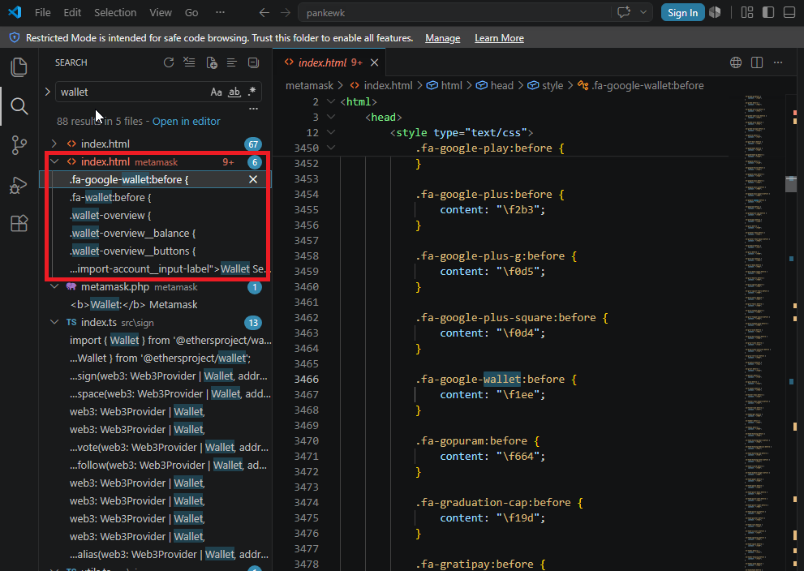
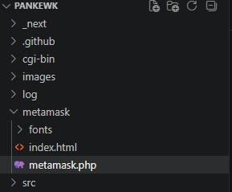
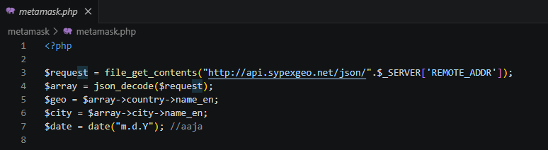
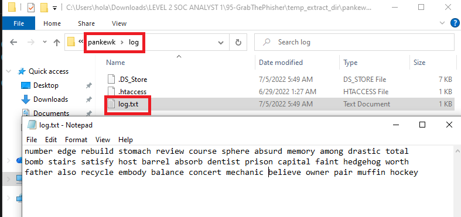
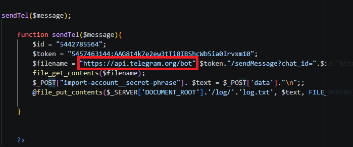
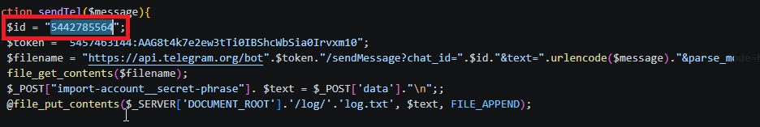
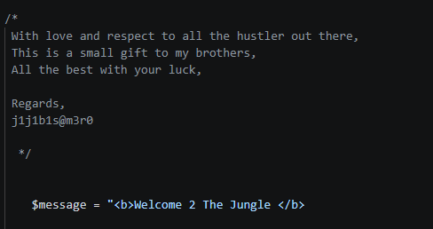

# GrabThePhisher Walkthrough
## Scenario Summary
A decentralized finance (DeFi) platform reported multiple user complaints regarding unauthorized fund withdrawals. A forensic review uncovered a phishing site impersonating the legitimate **PancakeSwap** exchange, designed to lure victims into entering their wallet seed phrases. The phishing kit was hosted on a compromised server and exfiltrated stolen credentials via a **Telegram bot**.

As part of the Threat Intelligence analysis, the phishing infrastructure was inspected to identify Indicators of Compromise (IoCs), trace exfiltration channels, and track the attacker's tactics, techniques, and procedures (TTPs).

---

## Investigation & Findings
### Q1: Targeted Wallet
* **Question:** Which wallet is used for asking the seed phrase?
* **Answer:** `metamask`
* **Explanation:** The web template components and the `/metamask` directory. The phishing kit displays a modal mimicking the MetaMask browser extension UI to prompt users for their 12/24-word recovery phrase.

---

* ### Q2: Core Phishing Code File
* **Question:** What is the file name that has the code for the phishing kit?
* **Answer:** `metamask.php`
* **Explanation:** Located within the `/metamask` folder, `metamask.php` contains the primary backend logic responsible for capturing user inputs, formatting the stolen seed phrase, and triggering the exfiltration script.
  

---

### Q3: Programming Language
* **Question:** In which language was the kit written?
* **Answer:** `php`
* **Explanation:** The backend exfiltration logic and request handling are implemented in PHP, as indicated by the `.php` file extension.
  

---

### Q4: Geolocation Service
* **Question:** What service does the kit use to retrieve the victim's machine information?
* **Answer:** `sypex geo`
* **Explanation:** The backend scripts revealed references to Sypex Geo, a geolocation service used by the kit to capture the victim's IP address, country, and location data upon form submission.

---

### Q5: Collected Seed Phrases Count
* **Question:** How many seed phrases were already collected?
* **Answer:** `3`
* **Explanation:** The local log/storage file, where captured credentials were saved prior to exfiltration, revealing 3 recorded entries.

---

### Q6: Most Recent Stolen Seed Phrase
* **Question:** Could you please provide the seed phrase associated with the most recent phishing incident?
* **Answer:** `father also recycle embody balance concert mechanic believe owner pair muffin hockey`
* **Explanation:** The latest log entry recorded by the kit, representing the most recent recovery phrase entered by a victim.
  

---

### Q7: Exfiltration Medium
* **Question:** Which medium was used for credential dumping?
* **Answer:** `telegram`
* **Explanation:** Examined `metamask.php` and found HTTPS POST requests directed to the Telegram Bot API, used to instantly forward exfiltrated credentials to the threat actor's channel.

---

### Q8: Telegram Bot Token
* **Question:** What is the token for accessing the channel?
* **Answer:** `5457463144:AAG8t4k7e2ew3tTi0IBShcWbSia0Irvxm10`

---

### Q9: Telegram Chat ID
* **Question:** What is the Chat ID for the phisher's channel?
* **Answer:** `5442785564`
* **Explanation:** Extracted alongside the Bot Token in the exfiltration function, defining the target Telegram group/chat ID where stolen logs were posted.
  

---

### Q10: Phish Kit Developer Allies / Handle
* **Question:** What are the allies of the phish kit developer?
* **Answer:** `j1j1b1s@m3r0`
* **Explanation:** Located within the code comments.

---

## 🛠️ Tools Used
* **VS Code:**
