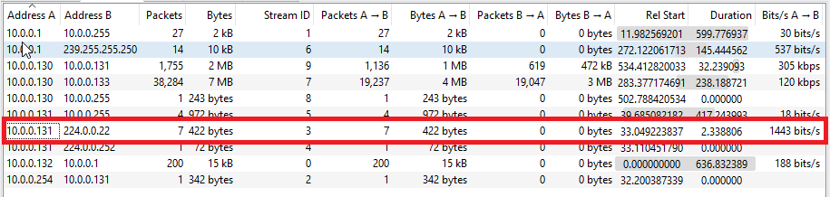
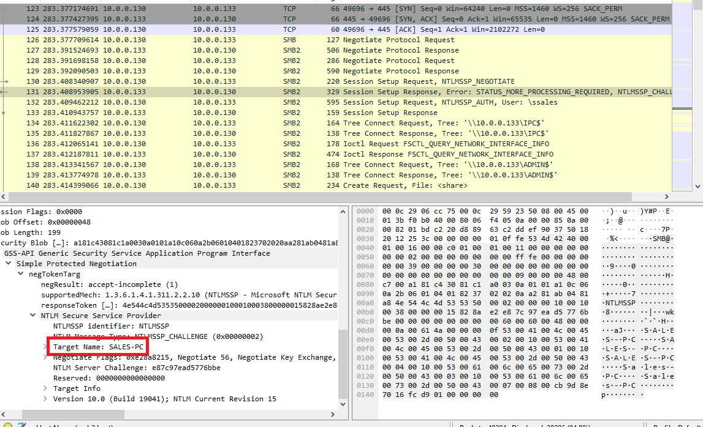
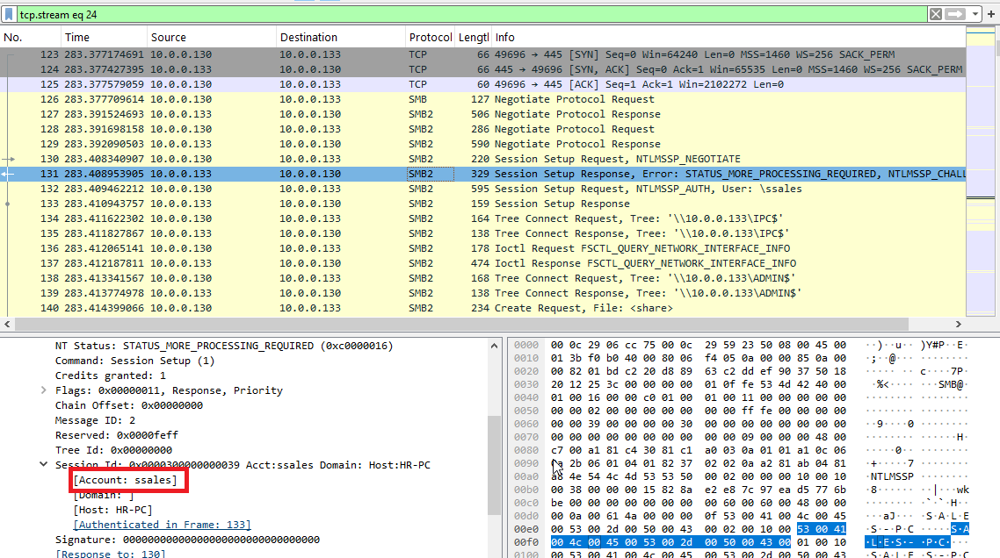
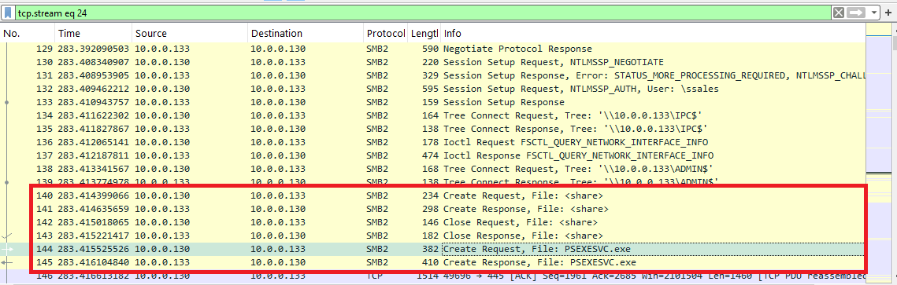
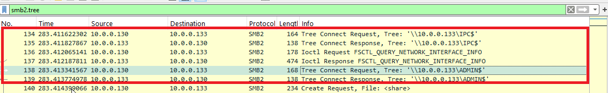
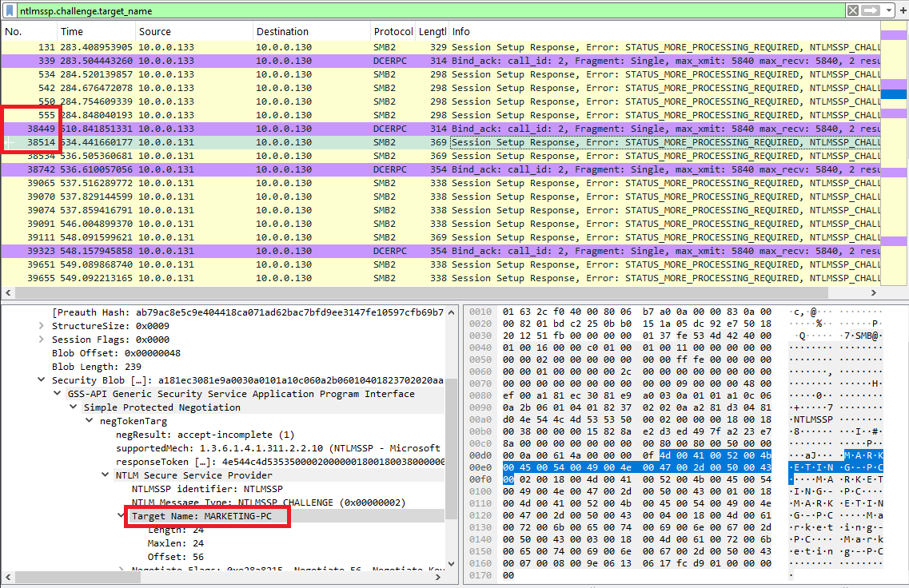

# PsExec Lateral Movement Analysis

## Scenario Summary 
An alert from the Intrusion Detection System (IDS) flagged suspicious lateral movement activity involving PsExec. This indicates potential unauthorized access and movement across the network. As a SOC Analyst, your task is to investigate the provided PCAP file to trace the attacker’s activities. Identify their entry point, the machines targeted, the extent of the breach, and any critical indicators that reveal their tactics and objectives within the compromised environment.
---

## Investigation and Questions

### Q1: Initial Access
* **Question:** `To effectively trace the attacker's activities within our network, can you identify the IP address of the machine from which the attacker initially gained access?`
* **Answer:** `10.0.0.130`
* **Explanation:** I identified by analyzing the high volume of traffic and initiating packets from the source host.

---

### Q2: First Pivot Hostname
* **Question:** `To fully understand the extent of the breach, can you determine the machine's hostname to which the attacker first pivoted?`
* **Answer:** `SALES-PC`
* **Explanation:** Located by inspecting the `Security Blob` in the NTLM authentication exchange, specifically extracting the destination target name.

---

### Q3: Compromised Account Username
* **Question:** `Knowing the username of the account the attacker used for authentication will give us insights into the extent of the breach. What is the username utilized by the attacker for authentication?`
* **Answer:** `ssales`
* **Explanation:** Found within the same NTLM authentication packet, confirming the compromised user account leveraged for the lateral movement.

---

### Q4: Service Executable Name
* **Question:** `After figuring out how the attacker moved within our network, we need to know what they did on the target machine. What's the name of the service executable the attacker set up on the target?`
* **Answer:** `PSEXESVC.exe`
* **Explanation:** Followed the TCP stream to trace the payload transfer, revealing the default PsExec service executable dropped onto the system.

---

### Q5: Installation Network Share
* **Question:** `We need to know how the attacker installed the service on the compromised machine to understand the attacker's lateral movement tactics. This can help identify other affected systems. Which network share was used by PsExec to install the service on the target machine?`
* **Answer:** `ADMIN$`
* **Explanation:** PsExec utilizes the hidden administrative share (`ADMIN$`, which maps to `C:\Windows`) to upload its malicious service binary to the target machine.

---

### Q6: Communication Network Share
* **Question:** `We must identify the network share used to communicate between the two machines. Which network share did PsExec use for communication?`
* **Answer:** `IPC$`

---

### Q7: Second Pivot Hostname
* **Question:** `Now that we have a clearer picture of the attacker's activities on the compromised machine, it's important to identify any further lateral movement. What is the hostname of the second machine the attacker targeted to pivot within our network?`
* **Answer:** `MARKETING-PC`
* **Explanation:** Filtered by `ntlmssp.challenge.target_name` to track the subsequent jump and authentication sequence from the intermediate host to the next target in the network.

---

## Tools Used
* **Wireshark**
