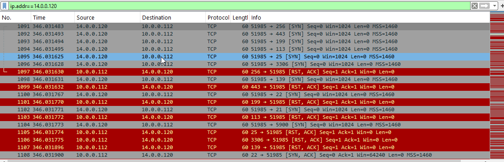
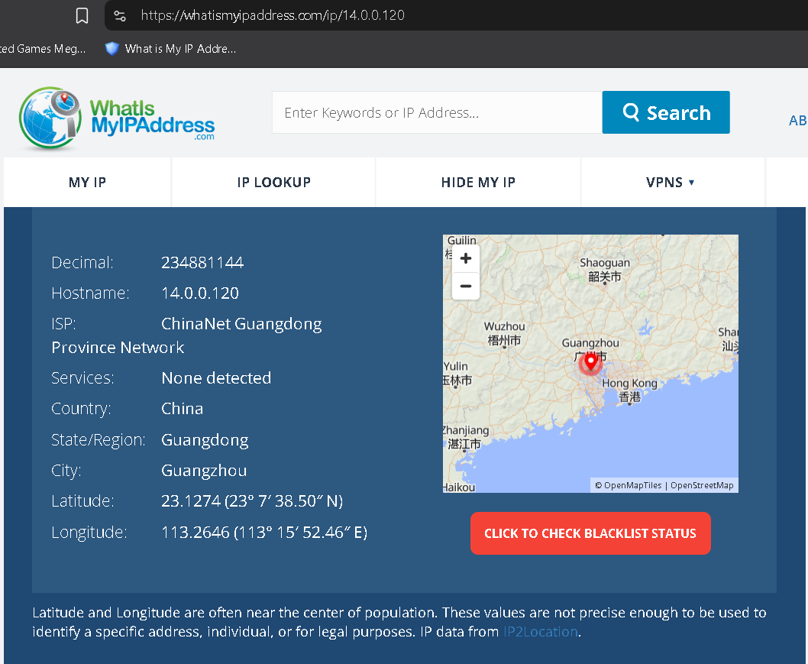
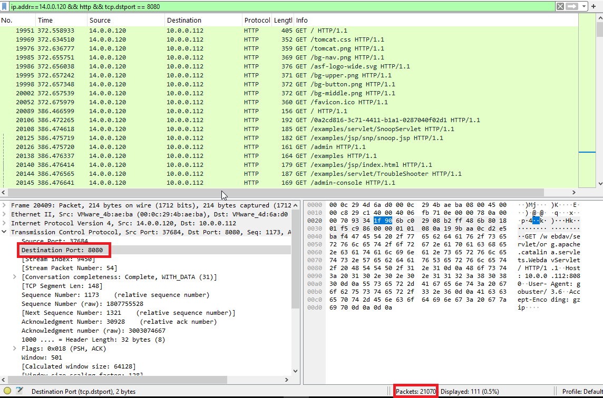
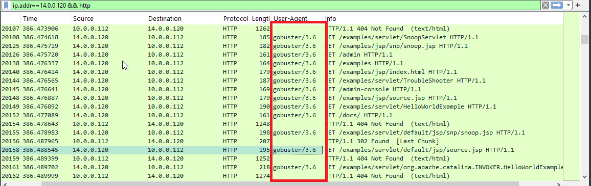
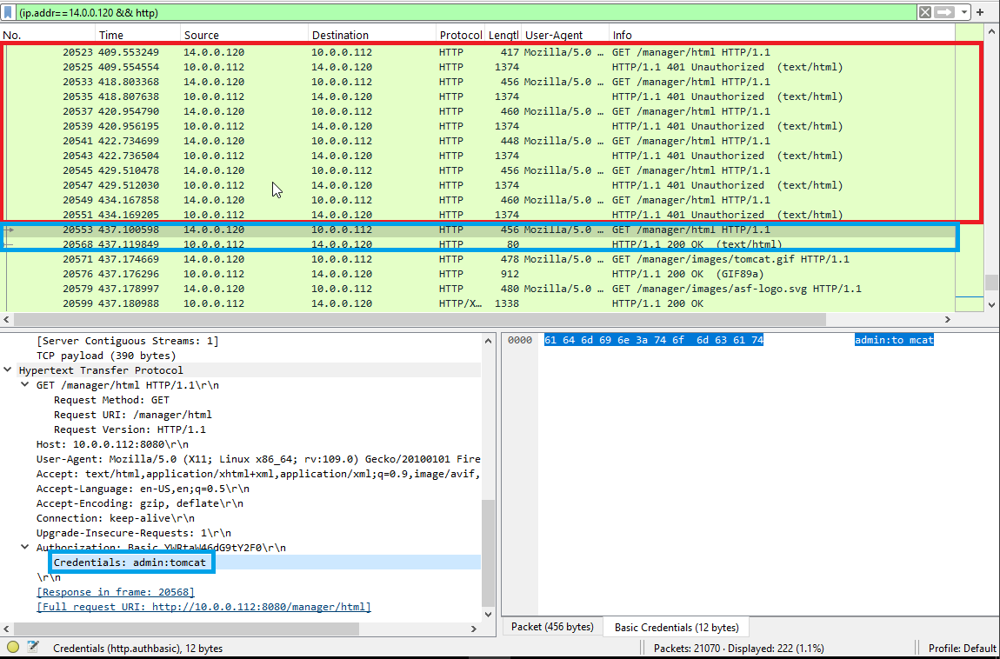
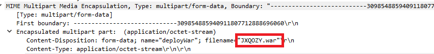
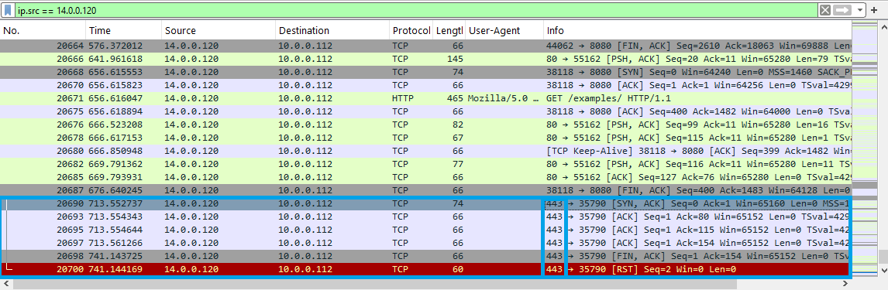

# Tomcat Takeover
## Scenario Summary
The SOC team has identified suspicious activity on a web server within the company's intranet. To better understand the situation, they have captured network traffic for analysis. The PCAP file may contain evidence of malicious activities that led to the compromise of the Apache Tomcat web server. Your task is to analyze the PCAP file to understand the scope of the attack.

---

### Q1: Attacker IP Address
* **Question:** Given the suspicious activity detected on the web server, the PCAP file reveals a series of requests across various ports, indicating potential scanning behavior. Can you identify the source IP address responsible for initiating these requests on our server?
* **Answer:** `14.0.0.120`
* **Explanation:** Identified by analyzing the initial TCP handshake and port scanning activity in Wireshark, where a high volume of connection requests originated from this source IP toward multiple destination ports. 

---

### Q2:
* **Question:** Based on the identified IP address associated with the attacker, can you identify the country from which the attacker's activities originated?
* **Answer:** `china`
* **Explanation:** Performed a geolocation lookup using IP lookup services (OSINT) on `14.0.0.120`, which mapped the IP address registry to China.

---

### Q3:
* **Question:** From the PCAP file, multiple open ports were detected as a result of the attacker's active scan. Which of these ports provides access to the web server admin panel?
* **Answer:** `8080` 
* **Explanation:** While HTTP traffic typically runs on port 80, the PCAP reveals HTTP requests targeting on port 8080.

---

### Q4:
* **Question:** Following the discovery of open ports on our server, it appears that the attacker attempted to enumerate and uncover directories and files on our web server. Which tools can you identify from the analysis that assisted the attacker in this enumeration process?
* **Answer:** `gobuster`
* **Explanation:** Inspecting the HTTP request headers (`User-Agent`) revealed the tool string identifying **Gobuster**.

---

### Q5:
* **Question:** After enumerating directories on our web server, the attacker made numerous requests to identify administrative interfaces. Which directory related to the admin panel did the attacker uncover? (Provide the path including the leading slash, e.g. /path)
* **Answer:** `/manager`
* **Explanation:** The attacker enumerated paths under Apache Tomcat and successfully accessed `/manager` (specifically `/manager/undeploy`), which responded with HTTP 200 OK / 401 Unauthorized prompts rather than 404 Not Found.

---

### Q6:
* **Question:** After accessing the admin panel, the attacker brute-forced the login. What credentials did the attacker successfully use? (Provide them in username:password format)
* **Answer:** `admin:tomcat`
* **Explanation:** Analyzed HTTP Basic Authentication requests (`Authorization: Basic`). Failed attempts returned `401 Unauthorized` responses, while the successful attempt with credentials `admin:tomcat` returned HTTP `200 OK`.

---

### Q7:
* **Question:** Once inside the admin panel, the attacker attempted to upload a file with the intent of establishing a reverse shell. Can you identify the name of this malicious file from the captured data?
* **Answer:** `JXQOZY.war`
* **Explanation:** Inspected the HTTP POST requests, Within the `multipart/form-data` payload (`Content-Disposition`), the filename parameter contained `JXQOZY.war`.

---

### Q8:
* **Question:** After the attacker established a reverse shell on our server, the payload connects back to the attacker's machine. From the analysis, what is the callback destination in IP:port format?
* **Answer:** `14.0.0.120:443`
* **Explanation:** Followed the TCP stream generated immediately after deploying the `.war` application, identifying an outbound TCP connection back to the attacker's listener on port 443.

---

## Tools Used
* Wireshark
* IP LookUp
