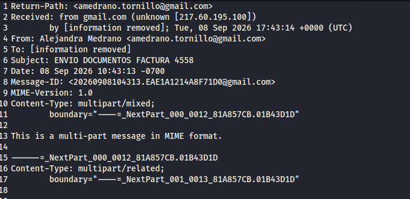

# Multi-Stage Malware Analysis & C2 Infrastructure Investigation

## Executive Summary
An investigation was conducted on a fresh threat sample delivered via a phishing email containing a compressed `.lzh` archive. Dynamic analysis in an isolated sandbox environment, correlated with PCAP network analysis, revealed a **4-stage execution chain** utilizing Living off the Land (LotL) binaries to establish an encrypted Command and Control (C2) session on a non-standard port with an infrastructure hosted in Pakistan.

---

## Environment & Incident Metadata
- **Analyzed File:** `PAGO-ENVIO DOCUMENTOS FACTURA 4558.LZH`
- **Dropper SHA256:** `5ba1eee1204710adfe1963b730de79c7a8089b173e811052e7be464fc5da1a1d`
- **Malicious IP / Location:** `43[.]228[.]157[.]141` (Pakistan 🇵🇰)
- **C2 Port & Protocol:** `7007 / TCP`
- **Sandbox Reference:** [Hybrid Analysis Sample Report](https://hybrid-analysis.com/sample/5ba1eee1204710adfe1963b730de79c7a8089b173e811052e7be464fc5da1a1d)

---

## 1. Infection Vector & Initial Access
The attack originated via a phishing email delivering a compressed archive named `PAGO-ENVIO DOCUMENTOS FACTURA 4558.LZH`. 

---

(imagen 1.1)

Inside the archive, an obfuscated JavaScript dropper was identified under the same name (`PAGO-ENVIO DOCUMENTOS FACTURA 4558.js`).

(imagen 1.2)

---

## 2. Dynamic Analysis & Execution Chain
Behavioral analysis in the sandbox confirmed a **4-stage execution sequence** designed to bypass security controls:
[WScript.exe] ──> [cmd.exe] ──> [powershell.exe] ──> [RegAsm.exe] (Injected)
1. **Stage 1 - Dropper (`WScript.exe`):**
   Executes `PAGO-ENVIO DOCUMENTOS FACTURA 4558.js`, acting as the initial stager. It creates a temporary working directory at `%TEMP%\8x42tzxu\` and drops an intermediate batch script.
2. **Stage 2 - Command Bridge (`cmd.exe`):**
   `WScript.exe` invokes `cmd.exe` with the `/c` flag to silently run `%TEMP%\8x42tzxu\dat_77345_a7a1.cmd` and terminate immediately.
3. **Stage 3 - Loader (`powershell.exe`):**
   `cmd.exe` launches PowerShell to execute `%TEMP%\8x42tzxu\cfg_108960_a743.ps1` using defense evasion parameters:
   - `-w h` (`-WindowStyle Hidden`): Hides the PowerShell console window from the user.
   - `-nop` (`-NoProfile`): Prevents loading user profiles for faster, unmonitored execution.
   - `Set-ExecutionPolicy Bypass -Scope Process -Force`: Overrides the local script execution policy.
4. **Stage 4 - Payload Execution / Defense Evasion (`RegAsm.exe`):**
   PowerShell spawns `RegAsm.exe` (a legitimate Microsoft .NET utility). Rather than exploiting a vulnerability in `RegAsm.exe`, the malware abuses it as a trusted process wrapper (Process Injection / Hollowing) to conceal its execution and initiate outbound connections.

(Imagen 2.2)

---

## 3. Network Analysis & C2 Verification (.pcap)
Deep packet inspection of the `.pcap` capture confirmed an active **Command and Control (C2)** channel established between the victim host and `43[.]228[.]157[.]141:7007/TCP`.

(Imagen 3.0)

### C2 Protocol Characteristics:
* **Asymmetric Exchange:** The malicious IP (red stream) transmits variable-length encrypted command blocks (e.g., 48 to 288 bytes).
* **Malware Beaconing:** The compromised host (blue stream) consistently responds with fixed 16-byte acknowledgment frames (`16......X.?......` / `16....e............`), representing the active **ACK/Heartbeat** signal of the trojan.
* **Non-Standard Transport:** The use of raw TCP on port `7007` with custom binary encryption confirms an intentional attempt to evade perimeter IDS/IPS inspection.

---

## 4. MITRE ATT&CK Mapping
---

(imagen mitreattack)

---

| Tactic | Technique | ID | Observed Artifact / Behavior |
| :--- | :--- | :--- | :--- |
| **Initial Access** | Phishing: Malicious Attachment | `T1566.001` | Delivery via `.LZH` archive. |
| **Execution** | Command and Scripting Interpreter: JS | `T1059.007` | Execution of `.js` via `WScript.exe`. |
| **Execution** | Command and Scripting Interpreter: PowerShell | `T1059.001` | Execution of `.ps1` loader with bypass flags. |
| **Defense Evasion** | Impair Defenses: Modify Tools | `T1562.001` | `Set-ExecutionPolicy Bypass` flag usage. |
| **Defense Evasion** | System Binary Proxy Execution | `T1218` | Living off the Land binaries (`WScript`, `cmd`, `RegAsm`). |
| **Defense Evasion** | Process Injection | `T1055` | Abuse of `RegAsm.exe` to proxy malicious execution. |
| **Command & Control** | Non-Standard Port | `T1571` | Outbound communication over port `7007/TCP`. |
| **Command & Control** | Encrypted Channel: Symmetric Cryptography | `T1573.001` | Custom encrypted TCP beaconing exchange. |

---

## 5. Indicators of Compromise (IoCs)

| Artifact Type | Indicator / Path | Context |
| :--- | :--- | :--- |
| **Archive Hash (SHA256)** | `5ba1eee1204710adfe1963b730de79c7a8089b173e811052e7be464fc5da1a1d` | Sample Submitted File |
| **File Path** | `%TEMP%\8x42tzxu\dat_77345_a7a1.cmd` | Dropped Batch Stage |
| **File Path** | `%TEMP%\8x42tzxu\cfg_108960_a743.ps1` | PowerShell Loader |
| **Abused Process** | `C:\Windows\Microsoft.NET\Framework...\RegAsm.exe` | Proxy Execution Target |
| **C2 IP Address** | `43[.]228[.]157[.]141` | Pakistan Remote Host |
| **C2 Port & Protocol** | `7007 / TCP` | Active Command & Control Channel |
